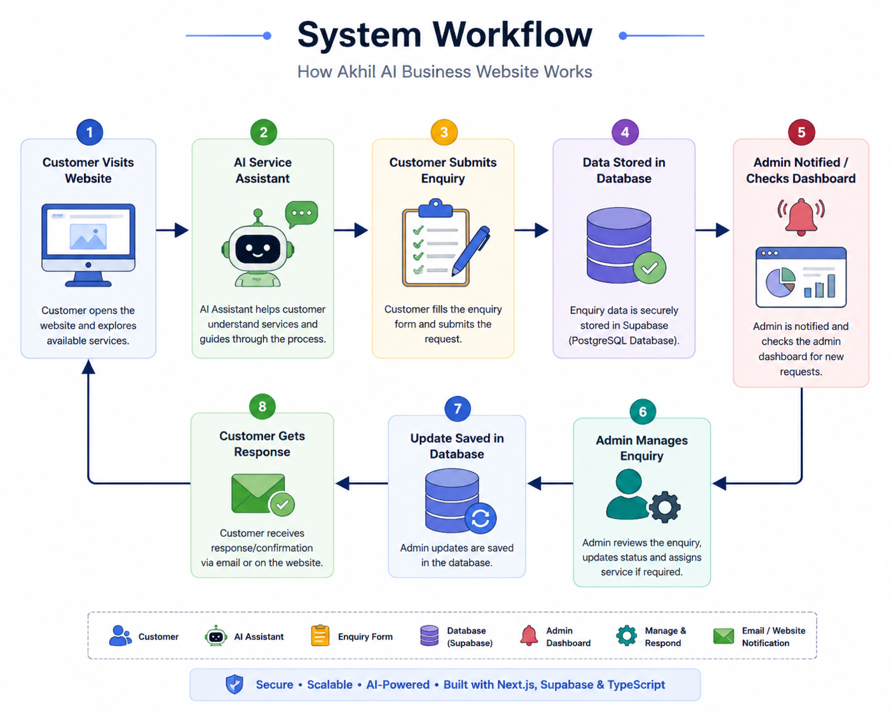
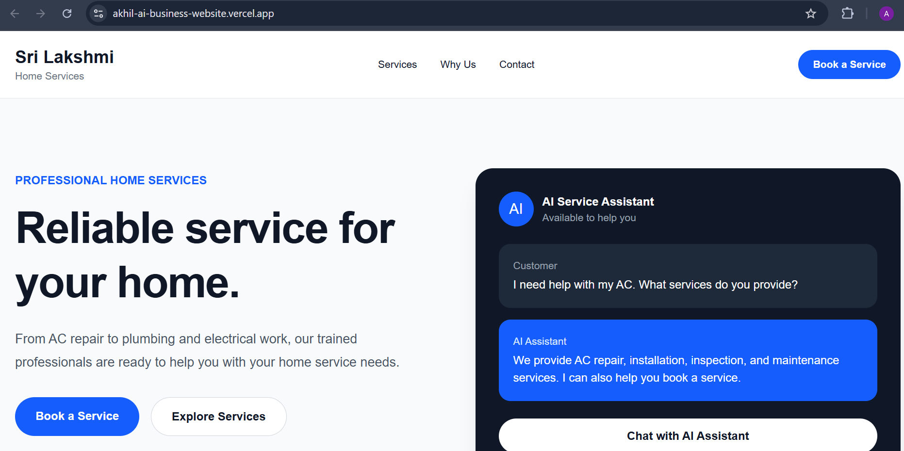
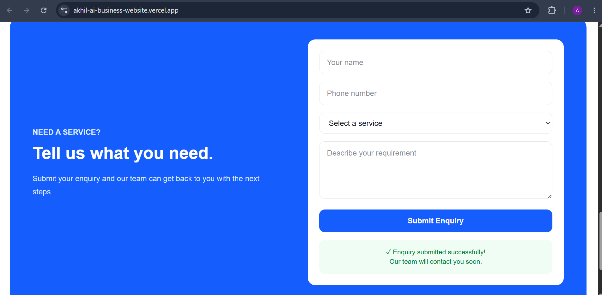
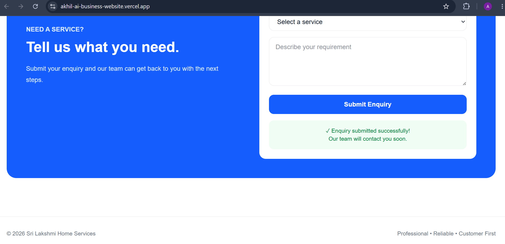
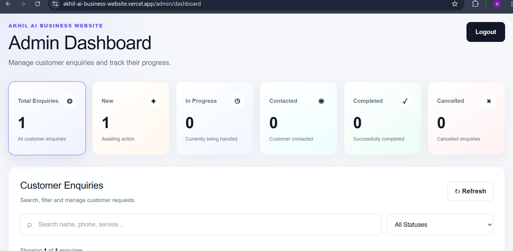
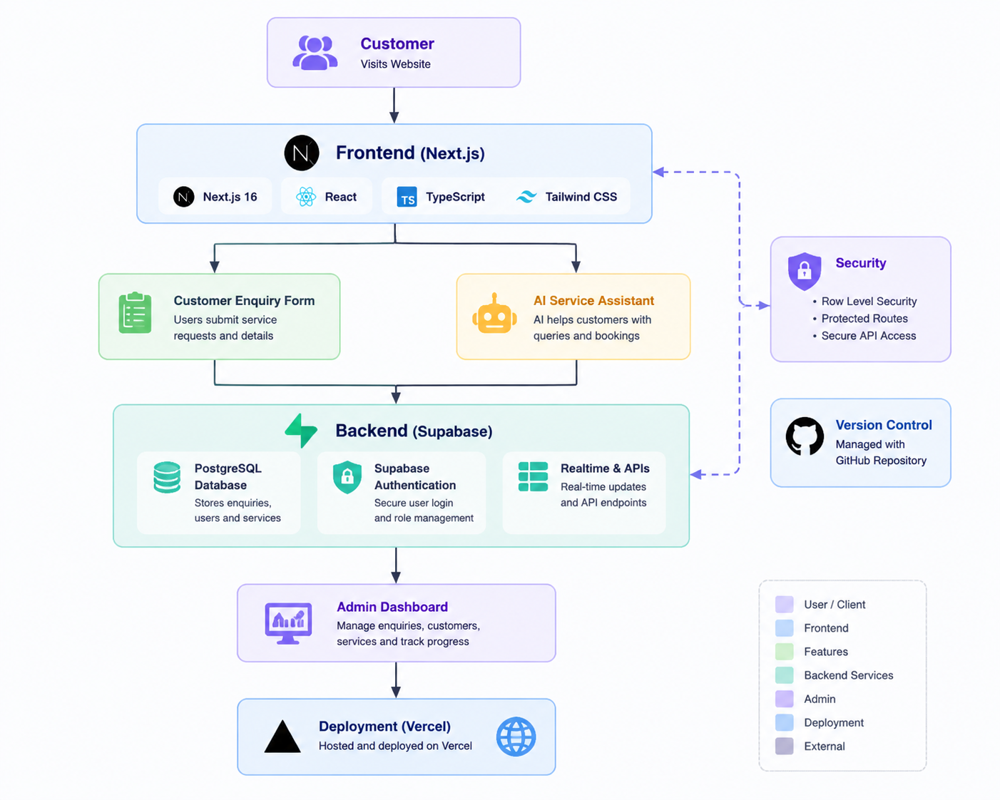

# Akhil AI Business Website

A modern AI-powered home service business website built with Next.js, Supabase, and TypeScript.

This project includes a customer enquiry system, AI service assistant interface, secure admin authentication, and an enquiry management dashboard.

---

---

## 🎯 Problem Statement

Small home service businesses often face challenges such as:

- Managing customer enquiries manually
- Tracking service requests efficiently
- Providing quick responses to customers
- Maintaining organized customer information

This project solves these challenges by providing an AI-powered business website with customer enquiry management, AI assistance, and an admin dashboard for tracking service requests.

---

## 🚀 Live Demo

https://akhil-ai-business-website.vercel.app

---

## ✨ Features

### Customer Side

- Modern responsive business website
- Service information section
- Customer enquiry form
- Service selection
- Requirement submission
- Success confirmation

### AI Assistant

- AI service assistant UI
- Customer support interaction design
- Helps users understand available services

### Admin Dashboard

- Secure admin login
- Supabase authentication
- Customer enquiry management
- Search enquiries
- Filter by enquiry status
- Update enquiry status

### Security

- Supabase Row Level Security (RLS)
- Protected database access
- Authentication-based admin access

---

## 🛠️ Tech Stack

### Frontend

- Next.js 16
- React
- TypeScript
- Tailwind CSS

### Backend

- Supabase
- PostgreSQL
- Supabase Auth

### Deployment

- Vercel
- GitHub

---

---

## 🚀 Key Features

### 👤 Customer Side
- Modern responsive home service website
- AI Service Assistant interface
- Customer enquiry submission system
- Service selection and requirement capture
- Success confirmation after submission

### 🤖 AI Assistant
- AI-powered customer support interface
- Helps users understand available services
- Guides customers toward booking a service

### 🔐 Admin Dashboard
- Secure admin authentication
- Customer enquiry management
- Search and filter enquiries
- Update enquiry status
- Track service request progress

### 🛡️ Security
- Supabase Authentication
- Row Level Security (RLS)
- Protected database access
- Secure admin routes

---

---

## ⚙️ Technical Implementation

### Frontend

- Built using Next.js App Router
- Developed reusable React components
- TypeScript used for type safety
- Tailwind CSS used for responsive UI design

### Backend & Database

- Supabase used as backend platform
- PostgreSQL database for storing customer enquiries
- Supabase Authentication for secure admin login
- API integration for data communication

### AI Integration

- AI Service Assistant interface for customer support
- Designed for future LLM integration
- Helps customers understand available services and booking process

### Security

- Protected admin routes
- Environment variable management
- Row Level Security (RLS) for database protection

---

---

## 🚀 Future Improvements

The following features can be added in future versions:

- Integrate a real LLM-powered customer support chatbot
- Add appointment scheduling system
- Add email and SMS notifications
- Add customer service history tracking
- Add analytics dashboard for business insights
- Add online payment integration
- Add AI-based service recommendations

---

---

## 🧠 Challenges & Learnings

During the development of this project, I worked on solving several engineering challenges:

- Designing a scalable frontend architecture using Next.js App Router
- Building reusable React components for better maintainability
- Managing customer enquiry data with Supabase and PostgreSQL
- Implementing secure authentication and protected admin routes
- Connecting frontend applications with backend APIs
- Handling environment variables securely
- Deploying and maintaining the application using Vercel
- Documenting the complete system architecture and development process

---

---

## 🔄 System Workflow

The application follows this workflow:

## 📸 Screenshots

### 🏠 Home Page

### 📝 Customer Enquiry Form

### ✅ Enquiry Submission Success

### 🔐 Admin Dashboard

## 🏗️ Architecture

